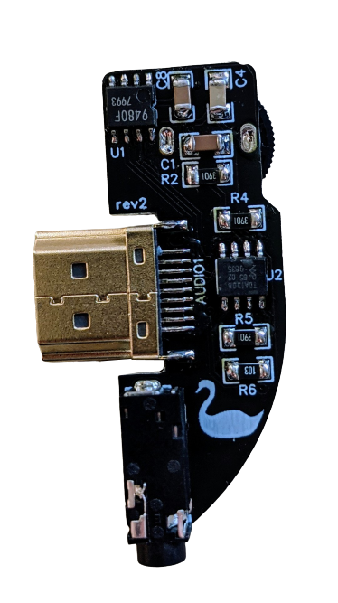
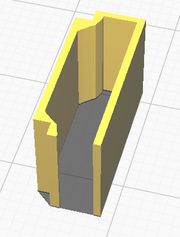

# WS Headphone
An open headphone adapter for the WonderSwan.

## Parts
| **Reference** | **Value**| **Links**
|---------------|----------|----------|
| AUDIO1        | Vertical HDMI male connector (1.6 mm board width) |[LCSC](https://lcsc.com/product-detail/D-Sub-DVI-HDMI-Connectors_Jing-Extension-of-the-Electronic-Co-920-867A2021Y10100_C168715.html)|
| CN1           | 3.5 mm headphone jack (5 pin) |[LCSC](https://lcsc.com/product-detail/Audio-Connectors_XKB-Connectivity-PJ-328A0-B_C381129.html)|
| U1            | BU9480f |[AliExpress](https://aliexpress.com/item/1005001856558893.html)|
| U2            | TDA1308T |[AliExpress](https://aliexpress.com/item/33020207730.html)|
| R1            | 10 kOhm dual potentiometer (e.g. Alps Alpine RK10J12R0A0B) |[LCSC](https://lcsc.com/product-detail/Variable-Resistors-Potentiometers_ALPSALPINE-RK10J12R0A0B_C351175.html)|
| R2, R3, R4, R5 | 3.9 kOhm resistor (1206 SMD) ||
| R6, R7 | 10 kOhm resistor (1206 SMD) ||
| C1, C2 | 1 uF capacitor (1206 SMD) ||
| C3 | 22 uF capacitor (1206 SMD) ||
| C4 | 100 nF capacitor (1206 SMD) ||
| C6, C7 | 100 uF capacitor (1206 SMD) ||
| C8 | 10 uF (1206 SMD) ||

## Connector Sleeve
In order to make the connector better fitting, I designed a sleeve for the HDMI connector which "extends" it physically to a WonderSwan EXT connector. It's 3D printable, you can find the STL here in the repo.

## Notes
Place the headphone connector to the very bottom of the WS connector (seen in landscape) to work properly when using without sleeve.

There is no case at the moment, anyone is welcome to create one :) .

## Disclaimer
**Use the files and/or schematics to build your own headphone adapter board at your own risk**.
This adapter works fine for me, but it's a simple hobby project, so there is no liability for errors in the schematics and/or board files.
**Use at your own risk**.
